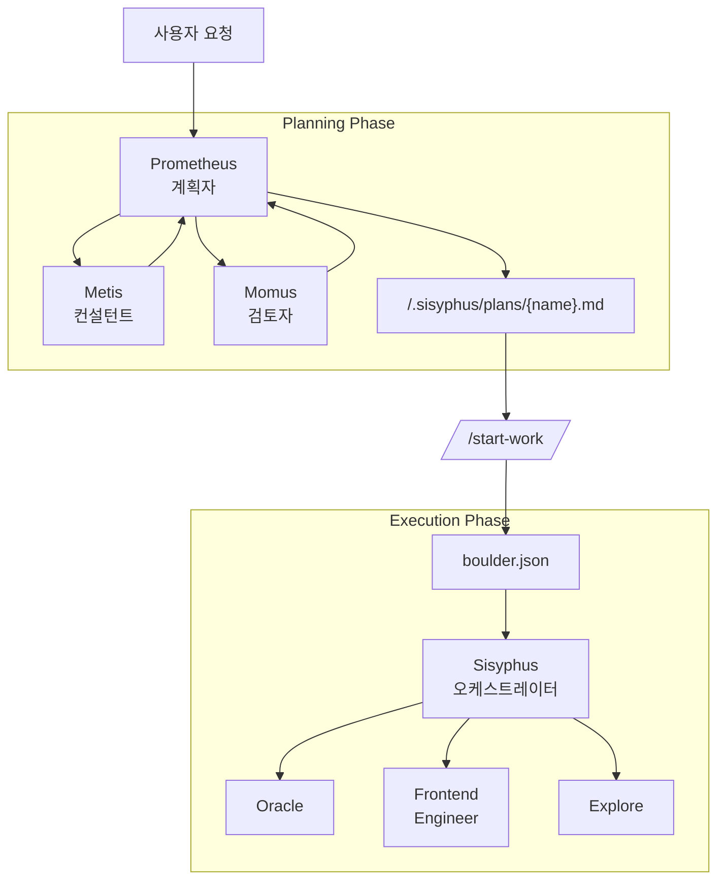

# Oh-My-OpenCode 오케스트레이션 가이드

## TL;DR - 언제 무엇을 사용할 것인가

| 복잡도 | 접근 방법 | 사용 시기 |
|------------|----------|-------------|
| **간단** | 그냥 프롬프트 | 간단한 작업, 빠른 수정, 단일 파일 변경 |
| **복잡 + 귀찮음** | 그냥 `ulw` 또는 `ultrawork` 입력 | 컨텍스트 설명이 귀찮은 복잡한 작업. 에이전트가 알아서 파악함. |
| **복잡 + 정밀** | `@plan` → `/start-work` | 진정한 오케스트레이션이 필요한 정밀한 다단계 작업. Prometheus가 계획하고 Sisyphus가 실행함. |

**의사결정 흐름:**
```
빠른 수정이나 간단한 작업인가?
  └─ YES → 그냥 일반적으로 프롬프트 입력
  └─ NO  → 전체 컨텍스트 설명이 귀찮은가?
             └─ YES → "ulw" 입력하고 에이전트가 알아서 파악하게 함
             └─ NO  → 정밀하고 검증 가능한 실행이 필요한가?
                        └─ YES → @plan으로 Prometheus 계획 수립 후 /start-work
                        └─ NO  → 그냥 "ulw" 사용
```

---

이 문서는 Oh-My-OpenCode의 핵심 철학인 **"계획과 실행의 분리"**를 구현하는 오케스트레이션 시스템에 대한 종합 가이드를 제공함.

## 1. 개요

전통적인 AI 에이전트는 계획과 실행을 혼합하여 컨텍스트 오염, 목표 이탈, AI slop(저품질 코드)을 유발함.

Oh-My-OpenCode는 두 역할을 명확히 분리하여 이를 해결함:

1. **Prometheus (계획자)**: 코드를 절대 작성하지 않는 순수 전략가. 인터뷰와 분석을 통해 완벽한 계획을 수립함.
2. **Sisyphus (실행자)**: 계획을 실행하는 오케스트레이터. 전문 에이전트에게 작업을 위임하고 완료될 때까지 절대 멈추지 않음.

---

## 2. 전체 아키텍처



---

## 3. 주요 구성요소

### 🔮 Prometheus (계획자)
- **모델**: `anthropic/claude-opus-4-5`
- **역할**: 전략적 계획 수립, 요구사항 인터뷰, 작업 계획 생성
- **제약**: **읽기 전용**. `.sisyphus/` 디렉토리 내에서 마크다운 파일만 생성/수정 가능.
- **특징**: 코드를 직접 작성하지 않고 "어떻게 할 것인가"에만 집중함.

### 🦉 Metis (컨설턴트)
- **역할**: 사전 분석 및 누락 사항 감지
- **기능**: 숨겨진 사용자 의도 식별, AI 과잉 엔지니어링 방지, 모호성 제거.
- **워크플로우**: 계획 생성 전 Metis 상담이 필수임.

### ⚖️ Momus (검토자)
- **역할**: 고정밀 계획 검증 (High Accuracy Mode)
- **기능**: 계획이 완벽할 때까지 거부하고 수정을 요구함.
- **트리거**: 사용자가 "high accuracy"를 요청할 때 활성화됨.

### 🪨 Sisyphus (오케스트레이터)
- **모델**: `anthropic/claude-opus-4-5` (Extended Thinking 32k)
- **역할**: 실행 및 위임
- **특징**: 모든 것을 직접 하지 않고 전문 에이전트(Frontend, Librarian 등)에게 적극적으로 위임함.

---

## 4. 워크플로우

### Phase 1: 인터뷰 및 계획 (Interview Mode)
Prometheus는 기본적으로 **인터뷰 모드**로 시작함. 즉시 계획을 만드는 대신 충분한 컨텍스트를 수집함.

1. **의도 식별**: 사용자 요청이 Refactoring인지 New Feature인지 분류함.
2. **컨텍스트 수집**: `explore` 및 `librarian` 에이전트를 통해 코드베이스와 외부 문서를 조사함.
3. **초안 작성**: `.sisyphus/drafts/`에 논의 내용을 지속적으로 기록함.

### Phase 2: 계획 생성
사용자가 "계획으로 만들어줘"라고 요청하면 계획 생성이 시작됨.

1. **Metis 상담**: 놓친 요구사항이나 위험 요소를 확인함.
2. **계획 생성**: `.sisyphus/plans/{name}.md` 파일에 하나의 계획을 작성함.
3. **인계**: 계획 생성이 완료되면 사용자에게 `/start-work` 명령어 사용을 안내함.

### Phase 3: 실행
사용자가 `/start-work`를 입력하면 실행 단계가 시작됨.

1. **상태 관리**: `boulder.json` 파일을 생성하여 현재 계획과 세션 ID를 추적함.
2. **작업 실행**: Sisyphus가 계획을 읽고 TODO를 하나씩 처리함.
3. **위임**: UI 작업은 Frontend 에이전트에게, 복잡한 로직은 Oracle에게 위임함.
4. **연속성**: 세션이 중단되어도 `boulder.json`을 통해 다음 세션에서 작업이 계속됨.

---

## 5. 명령어 및 사용법

### `@plan [요청]`
Prometheus를 호출하여 계획 세션을 시작함.
- 예시: `@plan "인증 시스템을 NextAuth로 리팩토링하고 싶어"`

### `/start-work`
생성된 계획을 실행함.
- 기능: `.sisyphus/plans/`에서 계획을 찾아 실행 모드로 진입함.
- 중단된 작업이 있으면 자동으로 중단된 지점부터 재개함.

---

## 6. 설정 가이드

`oh-my-opencode.json`에서 관련 기능을 제어할 수 있음.

```jsonc
{
  "sisyphus_agent": {
    "disabled": false,           // Sisyphus 오케스트레이션 활성화 (기본값: false)
    "planner_enabled": true,     // Prometheus 활성화 (기본값: true)
    "replace_plan": true         // 기본 plan 에이전트를 Prometheus로 교체 (기본값: true)
  },

  // 훅 설정 (비활성화하려면 추가)
  "disabled_hooks": [
    // "start-work",             // 실행 트리거 비활성화
    // "prometheus-md-only"      // Prometheus 쓰기 제한 제거 (권장하지 않음)
  ]
}
```

## 7. 모범 사례

1. **서두르지 말 것**: Prometheus와의 인터뷰에 충분한 시간을 투자할 것. 계획이 완벽할수록 실행이 빠름.
2. **단일 계획 원칙**: 작업이 아무리 크더라도 모든 TODO를 하나의 계획 파일(`.md`)에 담을 것. 이는 컨텍스트 단편화를 방지함.
3. **적극적 위임**: 실행 중에는 코드를 직접 수정하기보다 `sisyphus_task`를 통해 전문 에이전트에게 위임할 것.
